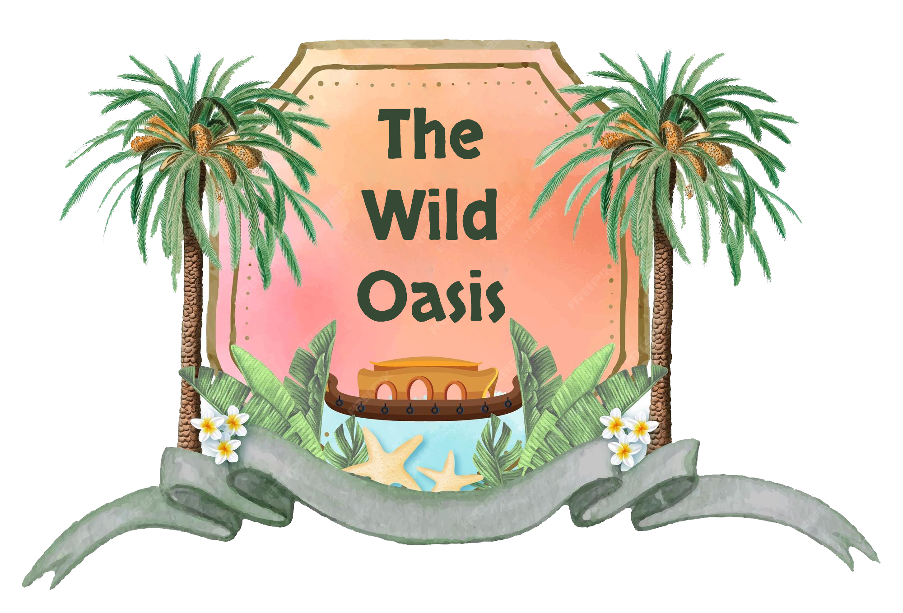
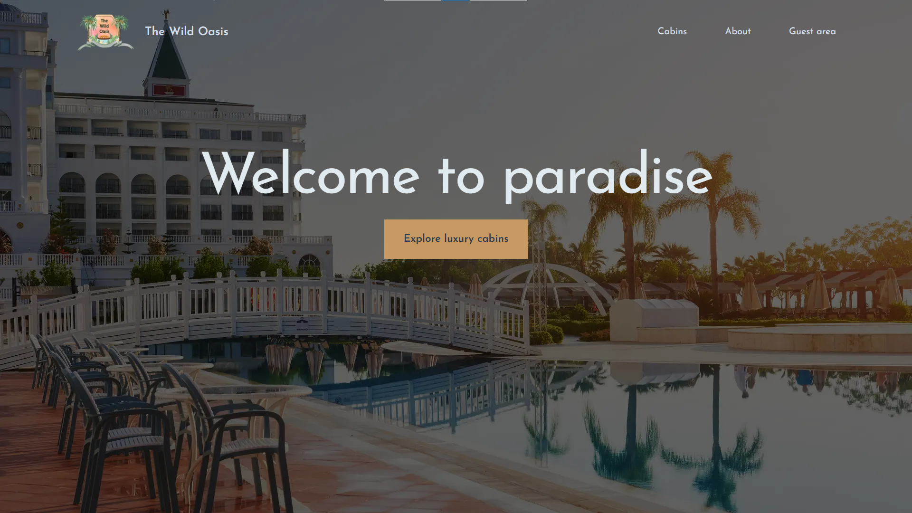

<div align="center">
  
  <h1>Wild Oasis - Customer</h1>
  <h3>
    <a href="https://wild-oasis-egy.vercel.app">
      <strong>Live Site</strong>
    </a>
  </h3>
  <hr>
</div>

<div align="center">
  
  
  
</div>

<p align="center">
Welcome to <b>Wild Oasis</b>! This is the customer version of the <a href="https://github.com/hazemhesham-1/wild-oasis">hotel management</a> web application, where users can view and book cabins based on availability, manage their bookings, and update their profiles. This project was a great learning experience for me as I explored Next.js, NextAuth.js, and other techniques such as Server-Side Rendering (SSR).
</p>

<!-- Screenshot -->
<a align="center" href="https://wild-oasis-egy.vercel.app">



</a>

## Features

- View all available cabins with description and images.
- Book a cabin based on available dates and choose the number of guests.
- Sign in with Github to manage your bookings.
- View your reservations, edit them, or cancel if needed.
- Update your profile information.

## Technologies Used

- **Next.js** (App Router)
- **Tailwind CSS** for styling
- **Supabase** for the database (shared with the admin app)
- **NextAuth.js** for authentication (Github sign-in)

## Setup Instructions

To run this project locally:

1. Clone the repo:
   ```bash
   git clone https://github.com/hazemhesham-1/wild-oasis-customer.git
   ```
2. Install dependencies:
   ```bash
   npm install
   ```
3. Set up environment variables:
   - You will need to configure Supabase and NextAuth (Github sign-in). Add your environment variables in a `.env.local` file.
4. Run the development server:
   ```bash
   npm run dev
   ```
5. Open [http://localhost:3000](http://localhost:3000) to see the app.

