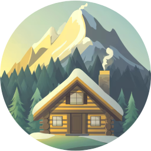
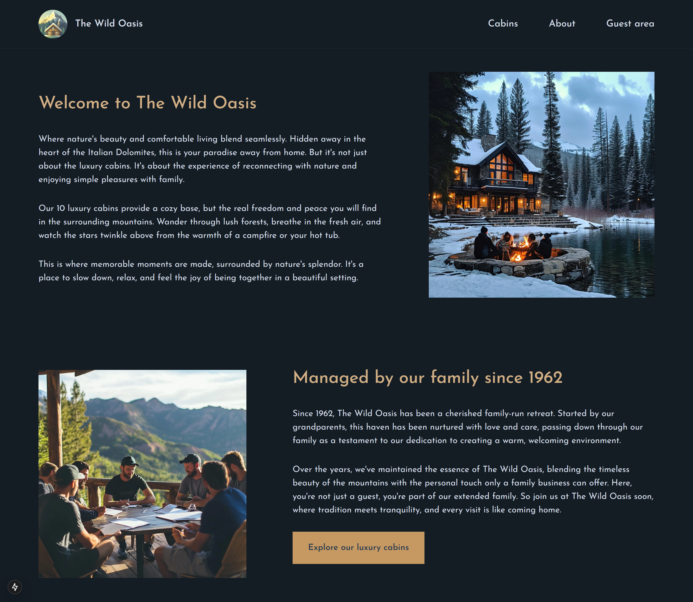
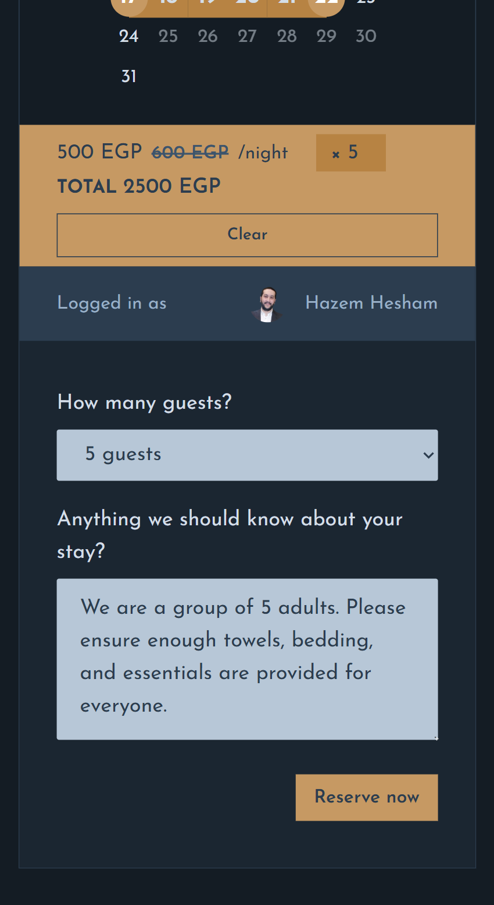

<div align="center">
    
    <h1>🏕️ Wild Oasis Website</h1>
    <h3>
        <a href="https://wild-oasis-egy.vercel.app">
            <strong>Live Site</strong>
        </a>
    </h3>
</div>


<div align="center">


</div>


<p align="center">
Welcome to <strong>Wild Oasis (Booking Website)</strong>! This is the customer version of the <a href="https://github.com/hazemhesham-1/wild-oasis">hotel management</a> web application. Whether you're here to learn, contribute, or just explore, you're very welcome! 😊
</p>


<a align="center" href="https://wild-oasis-egy.vercel.app">


</a>


## 📋 Overview

A Cabin Booking Web Application that allows users to browse available cabins, create bookings, manage reservations, and update their profile details. This project was a great learning experience where I explored technologies like **Next.js (App Router)**, **Auth.js**, **Supabase**. It demonstrates how to build a secure, dynamic, and user-friendly booking platform from scratch.


## 🌟 Project Features

- ### 1. 🏡 View Available Cabins
    - Browse a list of all available cabins, complete with descriptions, images, and key details to help users choose the perfect stay.
    - Filter by number of guests to quickly find cabins that match your group size and needs.

- ### 2. 📅 Cabin Booking
    - Select your desired dates and number of guests to check real-time availability and book a cabin with ease.

- ### 3. 🔐 Secure Authentication
    - Authenticate securely using your Google or GitHub account via Auth.js to access booking features and manage your profile.

- ### 4. 📖 Manage Your Reservations
    - Easily view all your current and past bookings, with options to edit or cancel upcoming reservations.

- ### 5. 🙋‍♂️ Update Profile Information
    - Keep your account information up to date by editing your personal details directly from your profile page.

- ### 6. 📱 Fully Responsive Design
    - Enjoy a seamless experience across all devices with a mobile-first, responsive layout that adapts beautifully to phones, tablets, and desktops.


## 📸 Screenshots

### Home Page
<div align="center" display="flex">
    
</div>

### Cabins Page
<div align="center" display="flex">
    
</div>

### Cabin Details Page
<div align="center" display="flex">
    
</div>

### Reservations Page
<div align="center" display="flex">
    
</div>

### Profile Overview
<div align="center" display="flex">
    
</div>

### Authentication Page
<div align="center" display="flex">
    
</div>

### About Page
<div align="center" display="flex">
    
</div>

### Mobile View – Responsive Design
<div align="center" display="flex">
    
    
    
</div>


## 🚀 Live Site

You can check out the live version of the app here: 👉 **[View Live Site](https://wild-oasis-egy.vercel.app)**


## 🛠️ Technologies Used

- **Next.js** – React framework for building full-stack, server-rendered web applications.
- **React** – Core library for building UI components.
- **Tailwind CSS** – Utility-first CSS framework for styling and responsive design.
- **Supabase** – Persistent data storage for cabins, users, and bookings.
- **Auth.js (NextAuth)** – Authentication and session management using Google and GitHub OAuth.
- **Vercel** – Deployment platform for frontend and serverless functions.


## 📦 Setup Instructions

To run this project locally:

1. Clone the Repository
   ```bash
   git clone https://github.com/hazemhesham-1/wild-oasis-customer.git
   cd wild-oasis-customer
   ```

2. Install Dependencies
   ```bash
   npm install
   ```

3. Configure Environment Variables
    - This project uses **Supabase** as the backend database and **Auth.js (NextAuth)** for authentication with GitHub or Google.
    - Create a `.env.local` file in the root of the project folder and add the following:

        ```dotenv
        # Supabase connection
        SUPABASE_URL=https://your-supabase-url.supabase.co
        SUPABASE_KEY=your-supabase-key

        # NextAuth configuration
        NEXTAUTH_URL=http://localhost:3000
        NEXTAUTH_SECRET=your_nextauth_secret

        # Google OAuth (optional if using Google)
        AUTH_GOOGLE_ID=your_google_client_id
        AUTH_GOOGLE_SECRET=your_google_client_secret

        # GitHub OAuth (optional if using GitHub)
        AUTH_GITHUB_ID=your_github_client_id
        AUTH_GITHUB_SECRET=your_github_client_secret
        ```

4. Run the Development Server
   ```bash
   npm run dev
   ```

5. Visit [http://localhost:3000](http://localhost:3000) in your browser to view the app.


## 📬 Contact Me

Thank you for taking the time to check out this project!

If you have any questions, feedback, or just want to connect, feel free to reach out:

**GitHub:** [hazemhesham-1](https://github.com/hazemhesham-1)